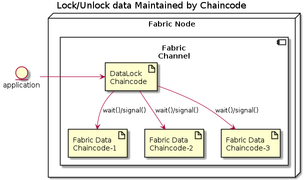
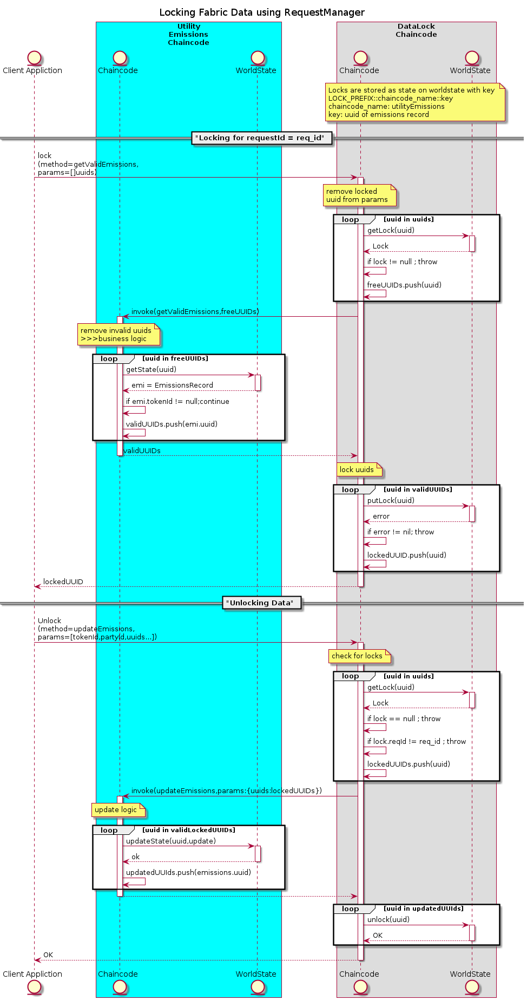

# DataLock Chaincode

Fabric chaincode for locking fabric data, while transactions related to the locked data are executed on different ledger/dataSource. Use of MVCC (Multiversion concurrency control) makes fabric a perfect blockchain for locking data. In fabric, MVCC is used for the solving double spending problem. DataLock uses the same facts, such that a single process with a unique id can only acquire lock.

To minimize number of call to fabric, business logic of data chaincode can be called from DataLock chaincode before locking or unlocking.

When locking the data present on different chaincode, rather then application invoking chaincode and chaincode having logic to interact with other chaincode. Now application can simply invoke to **DataLock** chaincode and with actual business logic implemented in the data chaincode. When application tries to lock a data maintained by a chaincode, **DataLock** chaincode invoke the required business logic on that chaincode, so that number of request to fabric network be minimized.

- [DataLock Chaincode](#datalock-chaincode)
- [Examples](#examples)
  - [Record Audited Emissions Token](#record-audited-emissions-token)

# Examples

## Record Audited Emissions Token

**Problem** : To mint a token on ethereum corresponding to a given emissions record data present on HL Fabric, and then update the emissions record with the minted tokenId.

